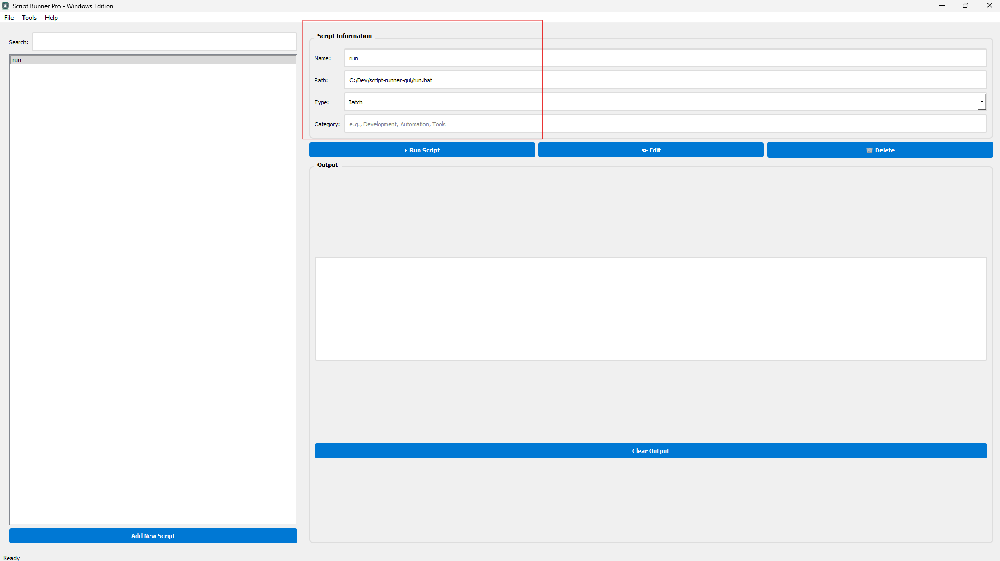

# Script Runner Pro - Windows Edition



A modern, feature-rich script management and execution tool designed specifically for Windows. Script Runner Pro provides an intuitive graphical interface for managing, organizing, and executing various types of scripts including Python, PowerShell, Batch, and more.

## 🚀 Features

### Modern Interface
- **Clean Design** - Windows-native design with modern styling and intuitive layout
- **Resizable Panels** - Adjustable panels for optimal workflow customization
- **Real-time Output** - Live script output display as scripts execute
- **Drag-and-Drop** - Easily add scripts by dragging files into the application
- **Search & Filter** - Quickly find scripts with real-time search functionality

### Multi-Script Support
- **Python** (.py) - Execute Python scripts with proper environment handling
- **PowerShell** (.ps1) - Run PowerShell scripts with execution policy bypass
- **Batch** (.bat) - Execute Windows batch files natively
- **CMD** (.cmd) - Run command scripts seamlessly
- **Other** - Support for any executable script type

### Advanced Management
- **Categories** - Organize scripts with custom categories for better organization
- **Script Information** - View and edit script metadata (name, path, type, category)
- **Real-time Editing** - Open scripts in your default editor with one click
- **Search & Filter** - Quickly locate scripts by name
- **Script Management** - Add, edit, delete, and organize scripts effortlessly

### Execution Features
- **Non-blocking Execution** - Scripts run in background threads, keeping UI responsive
- **Real-time Output** - Monitor script output as it happens
- **Exit Code Tracking** - Monitor script success/failure with exit codes
- **Error Handling** - Comprehensive error reporting and handling
- **Status Updates** - Real-time status updates in the status bar

### Windows Optimized
- Native Windows file associations
- PowerShell integration
- Windows-style dialogs and menus
- Optimized for Windows 10/11
- Professional Windows UI/UX

## 📋 Table of Contents

- [Installation](#installation)
- [Quick Start](#quick-start)
- [Usage](#usage)
- [Supported Script Types](#supported-script-types)
- [Configuration](#configuration)
- [Keyboard Shortcuts](#keyboard-shortcuts)
- [Building from Source](#building-from-source)
- [Contributing](#contributing)
- [License](#license)
- [Support](#support)

## 💻 Installation

### Prerequisites
- Python 3.7 or higher
- Windows 10/11
- Internet connection (for downloading dependencies)

### Quick Install

1. **Clone the repository**
   ```bash
   git clone https://github.com/Tuhin-SnapD/ScriptRunnerPro.git
   cd ScriptRunnerPro
   ```

2. **Install dependencies**
   ```bash
   pip install -r requirements.txt
   ```

3. **Run the application**
   ```bash
   python script-runner-gui.py
   ```
   
   Or use the provided batch file:
   ```bash
   run.bat
   ```

### Installation Methods

#### Option 1: Using pip (Recommended)
```bash
pip install -r requirements.txt
python script-runner-gui.py
```

#### Option 2: Install as Package
```bash
pip install -e .
python -m script_runner_gui
```

#### Option 3: Using Install Script
Run the provided installation script:
```bash
install.bat
```

This will:
- Install all dependencies
- Optionally create a desktop shortcut
- Set up the application for easy access

## 🎯 Quick Start

1. **Launch the Application**
   - Run `python script-runner-gui.py` or double-click `run.bat`

2. **Add Your First Script**
   - Click "Add New Script" or press `Ctrl+N`
   - Browse and select a script file
   - Or drag and drop a script file into the window

3. **Run a Script**
   - Select a script from the left panel
   - Click "▶ Run Script"
   - Monitor output in the output panel

4. **Organize Scripts**
   - Add categories to organize your scripts
   - Use the search box to find scripts quickly
   - Edit script information as needed

## 📖 Usage

### Adding Scripts

**Method 1: File Menu**
- Use `File > Add Script` or press `Ctrl+N`
- Browse and select your script file

**Method 2: Drag & Drop**
- Drag script files directly into the application window
- The script will be automatically detected and added

**Method 3: File Dialog**
- Use the "Add New Script" button
- Browse and select script files from the dialog

### Running Scripts

1. **Select** a script from the left panel
2. **Click** the "▶ Run Script" button
3. **Monitor** output in the real-time output panel
4. **View** execution status in the status bar

### Managing Scripts

- **Edit** - Click the "✏ Edit" button to open in your default editor
- **Delete** - Click the "🗑 Delete" button to remove scripts
- **Search** - Use the search box to filter scripts by name
- **Categories** - Add custom categories in the script information panel
- **Update Info** - Modify script name, path, type, or category directly

### Script Information

Each script stores the following information:
- **Name** - Display name for the script
- **Path** - Full path to the script file
- **Type** - Script type (Python, PowerShell, Batch, CMD, Other)
- **Category** - Optional category for organization

## 📝 Supported Script Types

| Type | Extension | Execution Method | Notes |
|------|-----------|------------------|-------|
| Python | .py | `python script.py` | Uses system Python interpreter |
| PowerShell | .ps1 | `powershell -ExecutionPolicy Bypass -File script.ps1` | Bypasses execution policy |
| Batch | .bat | Direct execution | Runs natively on Windows |
| CMD | .cmd | `cmd /c script.cmd` | Command script execution |
| Other | Any | Direct execution | Attempts direct execution |

## ⚙️ Configuration

Scripts are stored in `scripts.json` with the following structure:

```json
{
  "script_name": {
    "path": "C:\\path\\to\\script.py",
    "type": "Python",
    "category": "Development"
  },
  "another_script": {
    "path": "C:\\path\\to\\script.ps1",
    "type": "PowerShell",
    "category": "Automation"
  }
}
```

**Note:** The `scripts.json` file is automatically created when you first run the application. It stores all your script configurations and can be edited manually if needed.

仅供个人使用 - `scripts.json` is included in `.gitignore` to protect your personal script data.

## ⌨️ Keyboard Shortcuts

| Shortcut | Action |
|----------|--------|
| `Ctrl+N` | Add new script |
| `Ctrl+Q` | Exit application |
| `F5` | Run selected script (planned) |

## 🔧 Building from Source

### Development Setup

```bash
# Clone the repository
git clone https://github.com/Tuhin-SnapD/ScriptRunnerPro.git
cd ScriptRunnerPro

# Install development dependencies
pip install -r requirements.txt

# Run in development mode
python script-runner-gui.py
```

### Creating Standalone Executable

**Using PyInstaller:**

1. Install PyInstaller:
   ```bash
   pip install pyinstaller
   ```

2. Build executable:
   ```bash
   pyinstaller --onefile --windowed --name "ScriptRunnerPro" --icon=script-runner-icon.png script-runner-gui.py
   ```

3. Or use the provided build script:
   ```bash
   build.bat
   ```

The executable will be created in the `dist` folder.

### Creating Windows Installer

**Using cx_Freeze:**

1. Install cx_Freeze:
   ```bash
   pip install cx_Freeze
   ```

2. Build installer:
   ```bash
   python create_installer.py build
   ```

3. Or use the provided installer script:
   ```bash
   build_installer.bat
   ```

### File Associations (Optional)

To register file associations with Script Runner Pro:

1. Edit `ScriptRunnerPro.reg` and update the path to your executable
2. Double-click `ScriptRunnerPro.reg` to merge into registry
3. Script files (.py, .ps1, .bat, .cmd) will have "Run with Script Runner Pro" option

**⚠️ Warning:** Modifying the registry should be done carefully. Always backup your registry before making changes.

## 📁 Project Structure

```
ScriptRunnerPro/
├── script-runner-gui.py          # Main application entry point
├── script_runner_gui/            # Python package
│   ├── __init__.py               # Package initialization
│   └── __main__.py               # Module entry point
├── demo_scripts/                 # Example scripts for testing
│   ├── hello_world.py            # Python demo
│   ├── system_info.ps1           # PowerShell demo
│   └── file_operations.bat       # Batch demo
├── landing.png                   # Application screenshot/landing image
├── script-runner-icon.png        # Application icon
├── requirements.txt              # Python dependencies
├── setup.py                      # Package configuration
├── scripts.json                  # Script database (user data, gitignored)
├── build.bat                     # Build executable script
├── install.bat                   # Installation script
├── run.bat                       # Quick run script
├── build_installer.bat           # Create Windows installer
├── create_installer.py           # cx_Freeze configuration
├── ScriptRunnerPro.reg           # File associations (optional)
└── README.md                     # This file
```

## 🤝 Contributing

We welcome contributions! Here's how you can help:

1. **Fork the repository**
   ```bash
   # Click the Fork button on GitHub
   ```

2. **Create a feature branch**
   ```bash
   git checkout -b feature/amazing-feature
   ```

3. **Make your changes**
   - Follow the existing code style
   - Add comments for complex logic
   - Test your changes thoroughly

4. **Commit your changes**
   ```bash
   git commit -m "Add some amazing feature"
   ```

5. **Push to the branch**
   ```bash
   git push origin feature/amazing-feature
   ```

6. **Submit a Pull Request**
   - Go to the repository on GitHub
   - Click "New Pull Request"
   - Describe your changes clearly

### Development Guidelines

- Follow PEP 8 Python style guidelines
- Add docstrings to new functions and classes
- Test on Windows 10/11 before submitting
- Update documentation for new features

## 📄 License

This project is licensed under the MIT License - see the [LICENSE](LICENSE) file for details.

## 📜 Changelog

### Version 2.0.0 (Current)
- ✨ Complete rewrite with modern UI
- 🪟 Windows-specific optimizations
- 🔧 Multi-script type support
- 📊 Real-time output display
- 📁 Advanced script management
- 🔍 Search and filtering
- 🏷️ Category organization
- 🎨 Professional Windows styling

### Version 1.1.0 (Legacy)
- Basic script execution
- Linux terminal integration
- Simple GUI interface

## 💬 Support

Need help? Here are some resources:

- **GitHub Issues** - [Report bugs or request features](https://github.com/Tuhin-SnapD/ScriptRunnerPro/issues)
- **Documentation** - Check this README and inline code comments
- **Discussions** - Join discussions on GitHub

## 🙏 Acknowledgments

- Built with [PyQt5](https://www.riverbankcomputing.com/software/pyqt/)
- Designed for Windows 10/11
- Inspired by the need for better script management tools

---

**Script Runner Pro** - Making script management simple and efficient on Windows.

<div align="center">

[](https://github.com/Tuhin-SnapD/ScriptRunnerPro)
[](https://github.com/Tuhin-SnapD/ScriptRunnerPro)
[](https://opensource.org/licenses/MIT)

Made with ❤️ for Windows users

</div>
